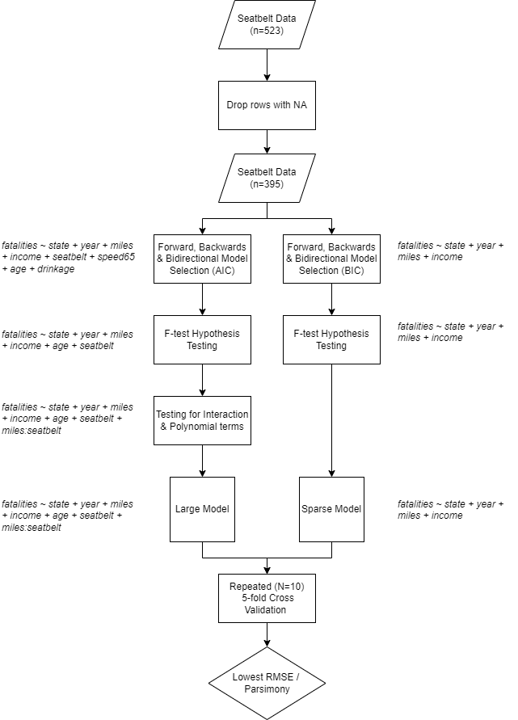

```{r setup, include=FALSE}
knitr::opts_chunk$set(echo = TRUE, warning = FALSE, message = FALSE, fig.width = 8)
```

```{r}

library(GGally)
library(dplyr)
library(visdat)
library(summarytools)
library(tidyr)
library(ggplot2)
library(naniar)
library(DT)
library(usmap)
library(caret)
library(glmnet)
library(kableExtra)
library(patchwork)
library(MASS)
library(latex2exp)
library(formula.tools)

```

## Data Description

```{r}
text_tbl <- data.frame(
  Variables = c("state", "year", "miles", "fatalities", "seatbelt", "speed65", "speed70", "drinkage", "alcohol", "income", "age", "enforce"),
  "Description of Variables" = c(
    "factor indicating US state (abbreviation)",
    "factor indicating year", 
    "millions of traffic miles per year",
    "number of fatalities per million of traffic miles (absolute frequencies of fatalities = fatalities times miles)",
    "seat belt usage rate, as self-reported by state population surveyed",
    "factor. Is there a 65 mile per hour speed limit?",
    "factor. Is there a 70 (or higher) mile per hour speed limit?",
    "factor. Is there a minimum drinking age of 21 years?",
    "factor. Is there a maximum of 0.08 blood alcohol content?",
    "median per capita income (in current US dollar)",
    "mean age",
    'factor indicating seat belt law enforcement ("no", "primary", "secondary")'
  ),
  Characteristics = c("", "", "", "outcome variable", "missing data", "", "", "", "", "", "", "")
)

kbl(text_tbl) %>%
  kable_paper(full_width = F) %>%
  column_spec(1, bold = T, border_right = T, width = "5em") %>%
  column_spec(2, width = "40em") %>%
  column_spec(3, border_left = T, width = "8em") %>%
  row_spec(4, background = "yellow")
```

### Background (Literature)

The `Seat-Belt-Laws` dataset analysed in this report was sourced from a study done by [Cohen & Einav (2003)](https://web.stanford.edu/~leinav/pubs/RESTAT2003.pdf) which assessed the influence seat belt laws had on usage rates and by extension, fatality. The original data is an amalgamation of multiple sources from between 1983 to 1997 on 50 US States and the District of Columbia - our version appears to be limited to 35.

```{r}

df = read.csv('https://raw.githubusercontent.com/mattshu0410/STAT3022-MLR-Seat-Belt-Laws/master/data/seatbelt_group_14.csv', stringsAsFactors = TRUE)

df %>% dplyr::select(state) %>% unique() %>% count() %>% pull()
data_nona = df %>% drop_na()
```

Before proceeding we have encoded year as a factor rather than a numeric as macro-effects such as horrible weather or ramped-up traffic safety campaigning differ year-to-year are unlikely to be a linear trend between years. We considered grouping states together by geo-spatial proximity however we decided against it as it would require us to make unreasonable assumptions about the inherent similarity between adjacent states. For instance, two nearby states may have very different road laws.

```{r}

df = df %>%
  mutate(year = as.factor(year))

```

In context of the study by [Cohen & Einav (2003)](https://web.stanford.edu/~leinav/pubs/RESTAT2003.pdf) which focused primarily on the impact of seat belt usage on fatalities, `year` and `state` were particularly important blocking variables. In our case, this is an indication we should likely include these factors as fixed effects in our model. This is further supported by contextual information which tells us that each state phased in seat belt laws at different years.

### Summary Statistics & Visualisations

#### Missing Values

Based on the visualization below, most of the missing values appear to arise from the seatbelt usage rate variable.

```{r}
vis_dat(df)

```

Based on the table below, it also appears there are two entries missing for the state of New York for the years of 1996 and 1997. 

```{r}

df %>%
  dplyr::select(state, year) %>%
  filter(state == "NY") %>%
  arrange(year) %>%
  datatable()

```

Upon closer inspection it appears that different states have varying degrees of sparsity

```{r echo=FALSE, result=FALSE, include=FALSE}

df %>%
  dplyr::select(state, year, seatbelt) %>%
  arrange(state, year) %>%
  filter_all(any_vars(is.na(.))) %>%
  datatable()

```

From the chloropleth plot we can see that there is a clump of southern states such as Arkansas, Arizona and New Mexico as well as states in the northeast such as Maine, Connecticut and Delaware which have a high number of missing values.

Furthermore it appears that the missing values follow a pattern whereby the earlier the year, the more missing values there are.

Both observations are consistent with study [Cohen & Einav (2003)](https://web.stanford.edu/~leinav/pubs/RESTAT2003.pdf) which has corroborated a consistent, complete National Highway Traffic Safety Administration (NHTSA source) between 1990-1999 with an incomplete source from the BRFSS between 1984-1997 that progressively added more states each year. 

```{r}

missing_df = df %>%
  dplyr::select(state, seatbelt) %>%
  group_by(state) %>%
  summarise(values = sum(is.na(seatbelt))/n()) %>%
  mutate(state = as.character(state))

# Missingness by State
plot_usmap(data = missing_df, color = "red", labels = TRUE) +
  scale_fill_continuous(
    low = "white",
    high = "red",
    name = "Missing Proportion"
  ) +
  theme(legend.position = "right") +
  labs(
    title = ""
  )

# Missingness by Year
df %>%
  dplyr::select(year, seatbelt) %>%
  gg_miss_fct(., fct = year)

```

#### Collinearity

From the correlation matrix, we can see that median per-capita income and seatbelt usage are highly correlated (r=0.60). The mean age and median per-capita income are also moderately correlated (r=0.40). There is strong limitation to this analysis is that this only captures the relationships between the quantitative variables.

High Collinearity
* `income` and `seatbelt`
* `age` and `income`

```{r, results = FALSE}
#df %>%
#  dplyr::select(-seatbelt, -state) %>%
#  ggpairs()
#
#df
```

```{r}

df[,sapply(df, is.numeric)] %>%
  qtlcharts::iplotCorr()

```


#### Qualitative Variables

The violin box-plots show the distribution of fatalities per million miles of traffic `fatalities` for different levels of our categorical variables. We use a heuristic where any case of non-overlapping notches signify strong evidence at a 95% confidence level, that the medians of the compared levels differ. From the plots you can see that the implementation of a 65-mile speed limit `speed65`, a minimum drinking age `drinkage`, maximum BAC `alcohol` and any form of seat belt law enforcement `enforce` produced a strongly differentiated fatality rate.

```{r}

g6 <- ggplot(df, 
       aes(x = speed65, 
           y = fatalities)) +
  geom_violin(fill = "cornflowerblue") +
  geom_boxplot(notch = TRUE,
               width = .2, 
               fill = "orange",
               outlier.color = "orange",
               outlier.size = 2) + 
  labs(title = "Speed65 vs Fatalities") +
  theme_bw()

g7 <- ggplot(df, 
       aes(x = speed70, 
           y = fatalities)) +
  geom_violin(fill = "cornflowerblue") +
  geom_boxplot(notch = TRUE,
               width = .2, 
               fill = "orange",
               outlier.color = "orange",
               outlier.size = 2) + 
  labs(title = "Speed70 vs Fatalities") +
  theme_bw()

g8 <- ggplot(df, 
       aes(x = drinkage, 
           y = fatalities)) +
  geom_violin(fill = "cornflowerblue") +
  geom_boxplot(notch = TRUE,
               width = .2, 
               fill = "orange",
               outlier.color = "orange",
               outlier.size = 2) + 
  labs(title = "Drinkage vs Fatalities") +
  theme_bw()

g9 <- ggplot(df, 
       aes(x = alcohol, 
           y = fatalities)) +
  geom_violin(fill = "cornflowerblue") +
  geom_boxplot(notch = TRUE,
               width = .2, 
               fill = "orange",
               outlier.color = "orange",
               outlier.size = 2) + 
  labs(title = "Alcohol vs Fatalities") +
  theme_bw()

g10 <- ggplot(df, 
       aes(x = enforce, 
           y = fatalities)) +
  geom_violin(fill = "cornflowerblue") +
  geom_boxplot(notch = TRUE,
               width = .2, 
               fill = "orange",
               outlier.color = "orange",
               outlier.size = 2) + 
  labs(title = "Enforce vs Fatalities") +
  theme_bw()


g6+g7+g8+g9+g10+plot_layout(ncol = 3)

```

#### Quantitative Variables

From the boxplot visualisation, we can see that age is heavily left skewed, miles is heavily right skewed. `income` & `seatbelt` appear to be fairly normally distributed.

```{r}

# Boxplots for quantitative variables
df %>%
  dplyr::select(age, income, miles, seatbelt) %>%
  apply(., 2, scale) %>%
  data.frame() %>%
  pivot_longer(cols = 1:4,
               names_to = "variable",
               values_to = "value") %>%
  ggplot() +
  geom_boxplot() +
  aes(x = variable,
      y = value) +
  theme_bw() +
  labs(
    title = "Distribution of Normalised Quantitative Variables",
    x = "Variables",
    y = "Normalised Values"
  )


```
 


## Model Building

### Overview

This is a summary of our model building procedure.



### Variable Selection

To build our models, we consider the data frame `data_nona` where we remove the rows with the `NA` observations. Doing this is an example of listwise deletion. We consider two sets of models:

- The first set of models use the AIC critera to step through the covariates and
- The second set of models uses the BIC criteria to step through the covariates

Because we want to produce a parsimonious model, where we balance the accuracy of our model with the minimal amount of covariates, this is why we employ both the AIC and BIC criterion. As the AIC criterion tends to produce models with more covariates and the BIC criterion tends to produce models with less covariates (the penalty of the cost function is larger for the BIC) we aim to balance accuracy and number of covariates in this way.

With these two sets of models, we aim to arrive at two models

- With the first set of models (using the AIC criteria to step through) we employ forward, backward and bidirectional approaches. We then pick the best out of the three based on adjusted $R^2$ value
- With the second set of models (using the BIC criteria to step through we employ forward, backward and bidirectional approaches. We then pick the best out of the three based on adjusted $R^2$ value

```{r, results = 'hide'}
n = nrow(data_nona)
full_mod = lm(fatalities ~ ., data = data_nona)
null_mod = lm(fatalities ~ 1, data = data_nona)
# The AIC criterion models
forward_aic = stepAIC(null_mod,
                      scope = list(upper = formula(full_mod),
                                   lower = formula(null_mod)),
                      direction = 'forward',
                      k = 2)
backward_aic = stepAIC(full_mod,
                      scope = list(upper = formula(full_mod),
                                   lower = formula(null_mod)),
                      direction = 'backward',
                      k = 2)
bidir_aic = stepAIC(full_mod,
                      scope = list(upper = formula(full_mod),
                                   lower = formula(null_mod)),
                      direction = 'both',
                      k = 2)
# The BIC criterion models
forward_bic = stepAIC(null_mod,
                      scope = list(upper = formula(full_mod),
                                   lower = formula(null_mod)),
                      direction = 'forward',
                      k = log(n))
backward_bic = stepAIC(full_mod,
                      scope = list(upper = formula(full_mod),
                                   lower = formula(null_mod)),
                      direction = 'backward',
                      k = log(n))
bidir_bic = stepAIC(full_mod,
                      scope = list(upper = formula(full_mod),
                                   lower = formula(null_mod)),
                      direction = 'both',
                      k = log(n))
```

For the AIC criterion we see the models: 

- forward 
  - adj $R^2$ : `r summary(forward_aic)$adj.r.squared`
  - formula: `r as.character(formula(forward_aic))`
- backward 
  - adj $R^2$ : `r summary(backward_aic)$adj.r.squared`
  - formula: `r as.character(formula(backward_aic))`
- bidirectional
  - adj $R^2$ : `r summary(bidir_aic)$adj.r.squared`
  - formula: `r as.character(formula(bidir_aic))`

For the BIC criterion we see the models: 

- forward 
  - adj $R^2$ : `r summary(forward_bic)$adj.r.squared`
  - formula: `r as.character(formula(forward_bic))`
- backward 
  - adj $R^2$ : `r summary(backward_bic)$adj.r.squared`
  - formula: `r as.character(formula(backward_bic))`
- bidirectional 
  - adj $R^2$ : `r summary(bidir_bic)$adj.r.squared`
  - formula: `r as.character(formula(bidir_bic))`
  
${\large\underline{\smash{\text{Models we have so far}}}}$

Thus we see that the models we have arrived at so far are: 

- By the AIC criterion: 
$$fatalities \thicksim state + year + age + income + miles + seatbelt + speed65 + drinkage$$
- By the BIC crtierion $$fatalities \thicksim state + year + income + miles$$


### Multicollinearity

We now check the multicollinearity present in our model. 

A traditional VIF metric would not be appropriate as it is determined with respect to a single coefficient. We used a generalised collinearity diagnostic (GVIF) introduced by Fox & Monette (1992) where a fair comparison between variables is made by considering the following rule of thumb:

$$
(GVIF^{\frac{1}{2*df}})^2 > 10
$$
While we check for multicollinearity in this step we further note that because the goal of our model is prediction, the multicollinearity doesn't matter. This is because while multicollinearity makes the interpretation of the coefficients difficult (as it inflates the variances) the predicted values stay the same. 


The first model is given by: 

$$fatalities \thicksim state + year + age + income + miles + seatbelt + speed65 + drinkage$$

```{r}
mod1 = lm(fatalities ~ state + year + age + income + miles + seatbelt + speed65 + drinkage, data = data_nona)
```


We note that the generalised variance inflation factors are given by: 

```{r}
library(car)
vif(mod1)
```
So we see here that by considering the squares of the $GVIF^{\frac{1}{2DF}}$ we see that `age`, `income` and `miles` are covariates which are highly correlated with one or more other covariates

The second model is given by:

$$fatalities \thicksim state + year + income + miles$$


```{r}
mod2 = lm(fatalities ~ state + year + income + miles, data = data_nona)
```

We note that the generalized variance inflation factors are given by: 

```{r}
library(car)
vif(mod2)
```
And so we see `income` and `miles` are highly correlated with one another. 

### Inferences

We now check the significance of our variables with by using a combination of t-tests (with the `summary()` command) and f-test (with the `anova()` command). We do this from the model evaluation perspective, with the goal of seeing whether we can discard predictors (so that both our models are less complex). 

**Looking at the first model obtained by the AIC criterion**

Consider first the summary table for our first model obtained with the AIC criterion:

```{r}
summary(mod1)
```

It seems to suggest that `seatbelt`, `speed65` and `drinkage` are not significant. We use the F-test to verify this: 

```{r}
anova(lm(fatalities ~ state + year + age + miles + income + seatbelt + speed65 + drinkage, data = data_nona))
```
Thus we see: 

- At the 5\% level, given the covariates `speed65`, `seatbelt`, `income`, `miles`, `age`, `year` and `state` are in the model, the model containing `drinkage` is not statistically significant. So we can drop it. 
- Then  at the 5\% level, given the covariates `seatbelt`, `income`, `miles`, `age`, `year` and `state` are in the model, the model containing `speed65` is not statistically significant. So we can drop it.
- Hence we see that the AIC model becomes (by the F-test)

$$fatalities \thicksim state + year + age + income + miles + seatbelt$$
```{r}
# update mod1 to the most updated version
mod1 = lm(fatalities ~ state + year + age + income + miles + seatbelt, data = data_nona)
```


**Looking at the second model obtained by the BIC criterion**

Again we consider the summary and anova tables: 

```{r}
summary(mod2)
anova(mod2)
```
We see that all covariates are significant and nothing can be dropped. So we don't change our model obtained by the BIC criteria

**Note: we henceforth will refer to the model obtained by the AIC criteria as the larger model and the model obtained by the BIC criteria as the smaller model**

### Polynomial and interaction terms

Due to our goal of trying to find a balance between a model which fits well versus a model with a smaller number of covariates (that is to be parsimonious) we consider the polynomial and interaction term only for the larger model we have presented


We now consider the polynomial a polynomial term for the `income` variable because of the relationship we have between `income` and `fatalities`. That is, it looks quadratic! 

```{r}
ggplot(data = df, mapping = aes(x = income, y = fatalities)) + 
  geom_point() + 
  geom_smooth() +
  labs(title = 'fatalities vs income') + 
  theme_bw()
```

We now consider the polynomial a polynomial term for the `income` variable because of the relationship we have between `income` and `fatalities`. That is, it looks quadratic! 


Observing our larger model, to see if polynomial terms would increase the fit, we fit an arbitrarily high degree for `income` (degree 3) and read the resulting anova table:

```{r}
anova(lm(fatalities ~ state + year + age + miles + seatbelt + 
           income + 
           I(income^2) + 
           I(income^3), data = data_nona))
```
There is no significant change so we don't include the quadratic term. 

Next for our larger model, we consider an interaction term. By considering relevant contextual information our intuitive argument is that an increase or decrease in seat belt usage rate, should change the impact of total miles on the fatality rate.

we consider the interaction term between `miles` and `seatbelt` 
```{r}
anova(lm(fatalities ~ state + year + age + income + miles*seatbelt, data = data_nona))
```
Thus by the F-test, we see that given all the covariates in the larger model, the interaction term is still statistically significant. Hence we update our larger model to include this: 

```{r}
mod1 = lm(fatalities ~ state + year + age + income + miles + seatbelt + miles:seatbelt, data = data_nona)
```

The larger model is thus: 

$$fatalities \thicksim state + year + age + income + miles + seatbelt + miles:seatbelt$$
The smaller model is thus: 

$$fatalities \thicksim state + year + income + miles$$

### Checking Assumptions

For our larger model, which is now: 

$$fatalities \thicksim state + year + age + income + miles + seatbelt + miles:seatbelt$$
We check for heteroscedasticity and for linearity
```{r}
plot(mod1, which = 1)
plot(mod1, which = 2)
```

- As the spread of the residuals seems to be fairly constant and the red line is horizontal, the assumption of constant variance and linearity is satisfied
- As the QQ plot shows the stanardised resiudals lie along the line quite tightly, the assumption of normality is satisfied. 


For our smaller model, which is now: 
$$fatalities \thicksim state + year  + income + miles$$
We check for heteroscedasticity and for linearity
```{r}
plot(mod2, which = 1)
plot(mod2, which = 2)
```

Similar to the larger model, the smaller model has the linearity assumption, constant variance assumption and normality assumption satisfied. 

### Unusual Observations

For our larger model and smaller model we consider:

* Outliers
* High leverage observations
* Influential observations

${\large\underline{\smash{\text{Larger Model}}}}$

Our larger model is: 

$$fatalities \thicksim state + year + age + income + miles + seatbelt + miles:seatbelt$$

**OUTLIERS**

Firstly we look at potential outliers by looking at the externally studentized residuals. We assign observation numbers so that we can keep track of the observation we are referring to. 

```{r}
# number of observations
n = nrow(data_nona)
# create a new column for data frame
data_nona = data_nona %>% mutate(obs_num = 1:n)
# number of coefficients for our model
p = length(mod1$coefficients)
rst_df1 = data.frame(obs_num = 1:n, rst = rstudent(mod1))
```

1. The studentized residuals follow a $t$ distribution with $n - 1 -p = `r n-p`$ degrees of freedom
2. We compare the magnitude of the externally studentized residuals with the magnitude of the $1 - \alpha/(2n)$ quantile (bon-ferroni correction taken into account) and see whether any residuals are greater than such a quantile
3. We take $\alpha = 0.05$ as our significance level
4. We also look at the threshold of a studentized residual of greater than 3 as that could also indicate a potential outlier ([The Pennsylvania State University, STAT462 Applied Regression Analysis](https://online.stat.psu.edu/stat462/node/247/))

```{r}
# our threshold
threshold = qt(1 - 0.05/(2*n), df = n-p-1, lower.tail = TRUE)
# plot the threshold alongside the residual value of 3
plot(abs(rst_df1$rst), type = 'h', xlab = 'observation number', ylab = 'externally studentized residual')
abline(h = threshold, col = 'red')
abline(h = 3, col = 'blue')
legend(1, 4.4, legend = c('Bon ferroni Threshold'), col = c('red'), lty = 1, cex = 0.8)
# see if the magnitude of any of our studentized residuals are greater than the threshold
rst_df1 %>% filter(abs(rst) > threshold) %>% arrange(desc(abs(rst)))
rst_df1 %>% filter(abs(rst) > 3) %>% arrange(desc(abs(rst)))
```
- We flag two observations: 77, and 207 for having exceptionally high externally studentized residuals. 
- Furthermore we flag another observation: 99 having studentized residuals above 3

**HIGH LEVERAGE**

We use the `influence.measures()` command on our model to obtain values to do with leverage and influence: 


```{r}
influence_measures_1 = influence.measures(mod1)
influence_df_1 = data.frame(obs_num = 1:n, influence_measures_1$infmat, row.names = NULL)
```

We firstly look at leverage. To see the observations which have high leverage we: 

1. Define the average leverage: $\bar{h} = \frac{p}{n}$
2. See which observations have hat value greater than $2\bar{h}$ or $3\bar{h}$

```{r}
h_bar = p/n
plot(influence_df_1$hat, type = 'h', xlab = 'observation number', ylab = 'hat value')
abline(h = 3*h_bar, col = 'red')
abline(h = 2*h_bar, col = 'blue')
# for the legend
three_h_bar = TeX(r'($3\bar{h}$)')
two_h_bar = TeX(r'($2\bar{h}$)')
legend(1, 0.27, legend = c(three_h_bar, two_h_bar), col = c('red', 'blue'), lty = c(1, 1), cex = c(0.8, 0.8))
```

```{r}
# for observations which have leverage greater than 2(average leverage)
influence_df_1 %>% dplyr::select(obs_num, hat) %>% filter(abs(hat) > 2*h_bar) %>% arrange(desc(hat))
# for observations which have leverage greater than 3(average leverage)
influence_df_1 %>% dplyr::select(obs_num, hat) %>% filter(abs(hat) > 3*h_bar) %>% arrange(desc(hat))
```

- We see that the observations which are higher than $2\bar{h}$ are observations: 64, 241 and 292
- We see that there is one observation higher than $3\bar{h}$  which is observation 64

```{r}
data_nona %>% filter(obs_num %in% c(64, 241, 292))
summary(data_nona)
```

- We see that observation 64 has high leverage because it has relatively low value for `seatbelt` and high value for `miles`
- We see that observation 241 has high leverage because it has quite high `seatbelt` value with the highest value for `miles`
- There doesn't seem to be a reason as to why observation 292 would have high leverage. We note that even though it does cross the threshold for $2\bar{h}$ it boarders on it. 

**INFLUENTIAL POINTS**

We now observe the presence of influential points by looking at the dffits value and the cooks distance 

```{r}
influence_df_1 %>% arrange(desc(abs(dffit))) %>% dplyr::select(obs_num, dffit) %>% head(10)
influence_df_1 %>% arrange(desc(abs(cook.d))) %>% dplyr::select(obs_num, cook.d) %>% head(10)
plot(abs(influence_df_1$cook.d), type = 'h', xlab = 'observation number', ylab = 'cooks distance')
```

We note that the observations with observation numbers corresponding to 77 and 207 stand out in particular. 

```{r}
data_nona %>% filter(obs_num %in% c(77, 207))
```


- Observation 77 is influential becuase it is an outlier
- Observation 207 is also influential because it is an outlier. 


${\large\underline{\smash{\text{Smaller Model}}}}$

Our smaller model is: 

$$fatalities \thicksim state + year  + income + miles$$

**OUTLIERS**

Firstly we look at potential outliers by looking at the externally studentized residuals. We assign observation numbers so that we can keep track of the observation we are referring to. 

```{r}
# number of coefficients for our model
p = length(mod2$coefficients)
rst_df2 = data.frame(obs_num = 1:n, rst = rstudent(mod2))
```

1. The studentized residuals follow a $t$ distribution with $n - 1 -p = `r n-p`$ degrees of freedom
2. We compare the magnitude of the externally studentized residuals with the magnitude of the $1 - \alpha/(2n)$ quantile (bon-ferroni correction taken into account) and see whether any residuals are greater than such a quantile
3. We take $\alpha = 0.05$ as our significance level
4. We also look at the threshold of a studentized residual of greater than 3 as that could also indicate a potential outlier ([The Pennsylvania State University, STAT462 Applied Regression Analysis](https://online.stat.psu.edu/stat462/node/247/))

```{r}
# our threshold
threshold = qt(1 - 0.05/(2*n), df = n-p-1, lower.tail = TRUE)
# plot the threshold alongside the residual value of 3
plot(abs(rst_df2$rst), type = 'h', xlab = 'observation number', ylab = 'externally studentized residual')
abline(h = threshold, col = 'red')
abline(h = 3, col = 'blue')
legend(1, 4.5, legend = c('Bon ferroni Threshold'), col = c('red'), lty = 1, cex = 0.8)
# see if the magnitude of any of our studentized residuals are greater than the threshold
rst_df2 %>% filter(abs(rst) > threshold) %>% arrange(desc(abs(rst)))
rst_df2 %>% filter(abs(rst) > 3) %>% arrange(desc(abs(rst)))
```
- We flag the observation: 207 for having exceptionally high externally studentized residuals. 
- Furthermore we flag another two observation: 77 and 99 for having studentized residual above 3. 

**HIGH LEVERAGE**


```{r}
influence_measures_2 = influence.measures(mod2)
influence_df_2 = data.frame(obs_num = 1:n, influence_measures_2$infmat, row.names = NULL)
```

We firstly look at leverage. To see the observations which have high leverage we: 

1. Define the average leverage: $\bar{h} = \frac{p}{n}$
2. See which observations have hat value greater than $2\bar{h}$ or $3\bar{h}$

```{r}
h_bar = p/n
plot(influence_df_2$hat, type = 'h', xlab = 'observation number', ylab = 'hat value')
abline(h = 3*h_bar, col = 'red')
abline(h = 2*h_bar, col = 'blue')
# for the legend
three_h_bar = TeX(r'($3\bar{h}$)')
two_h_bar = TeX(r'($2\bar{h}$)')
legend(1, 0.22, legend = c(three_h_bar, two_h_bar), col = c('red', 'blue'), lty = c(1, 1), cex = c(0.8, 0.8))
```

```{r}
# for observations which have leverage greater than 2(average leverage)
influence_df_2 %>% dplyr::select(obs_num, hat) %>% filter(abs(hat) > 2*h_bar) %>% arrange(desc(hat))
# for observations which have leverage greater than 3(average leverage)
influence_df_2 %>% dplyr::select(obs_num, hat) %>% filter(abs(hat) > 3*h_bar) %>% arrange(desc(hat))
```

- We see that the which is higher than $2\bar{h}$ is observation 64
- We see that there are no observations which are higher than $3\bar{h}$ 

```{r}
data_nona %>% filter(obs_num %in% c(64))
summary(data_nona)
```

- We see that observation 64 has high leverage because it has relatively low value for `seatbelt` and high value for `miles`

**INFLUENTIAL POINTS**

We now observe the presence of influential points by looking at the dffits value and the cooks distance 

```{r}
influence_df_2 %>% arrange(desc(abs(dffit))) %>% dplyr::select(obs_num, dffit) %>% head(10)
influence_df_2 %>% arrange(desc(abs(cook.d))) %>% dplyr::select(obs_num, cook.d) %>% head(10)
plot(abs(influence_df_2$cook.d), type = 'h', xlab = 'observation number', ylab = 'cooks distance')
```

We note that the observations with observation numbers corresponding to 77 and 207 stand out in particular. 

```{r}
data_nona %>% filter(obs_num %in% c(77, 207))
```

- Observation 77 is influential becuase it is an outlier
- Observation 207 is also influential because it is an outlier. 

### Model Evaluation & Comparison

Our model selection procedure earlier - which considered information criterion - led to a sparse and a large model. To assess the generalisation ability as well as the stability of the model on unseen data, we perform Repeated (N=10) 5-fold Cross-Validation on both models. 

$$
fatalities ~ state + year + age + income + miles + seatbelt + miles:seatbelt
$$

$$
fatalities ~ state + year  + income + miles
$$

We chose to use three separate metrics, mean absolute error (MAE), root-mean-squared error (RMSE) and R-squared as each metric offers slightly different insight. For instance, MAE weights large and small errors equally whereas RMSE punishes larger errors severely.

In all three metrics, the notches of the boxplots overlap suggesting that there isn't sufficient evidence to support a significant difference in the out-of-sample performance between the two models. Therefore, in the interest of parsimony, we pick the model with the lesser number of covariates i.e. the sparse model. 

```{r}
# This function drops NA rows by default
# This function performs repeated k-fold cross validation
cross_validation = function(cvK, n_sim, df, formula){
  
  # Setup CV method
  cv_method = trainControl(method = "repeatedcv", 
                           number = cvK, 
                           repeats = n_sim, 
                           returnData = TRUE,
                           returnResamp = "final")


  # Train the model
  model = train(formula, 
                data = df %>% drop_na(), # Drop NA rows 
                method = "lm",
                trControl = cv_method )
  
  return(model)
  
}

# This function takes two models and names for models and returns CV plot
generate_cv_plot = function(model1, model2, name1, name2) {
  
  # Get the corre
  cv1 = model1$resample %>%
    mutate(Model = name1)
  cv2 = model2$resample %>%
    mutate(Model = name2)
  rbind(cv1, cv2) %>%
    dplyr::select(RMSE, Rsquared, MAE, Model) %>%
    group_by(Model) %>%
    pivot_longer(., cols = 1:3, names_to = "Metric", values_to = "Value") %>%
    ungroup() %>%
    ggplot() +
    aes(x = Model, y = Value) %>%
    geom_boxplot(notch = TRUE) +
    facet_wrap(facets = ~Metric, scales = "free") +
    theme_bw() +
    labs(
      x = "Model",
      y = "Metric Value",
      title = "Evaluation of Out-of-sample Performance",
      subtitle = "Repeated (N=10) 5-fold Cross-Validation"
    )
}

```

```{r}
# Here I calling cross-validation on two separate models
model1 = cross_validation(cvK = 5,
                          n_sim = 10,
                          df = df,
                          formula = fatalities ~ state + year + age + income + miles + seatbelt + miles:seatbelt)

model2 = cross_validation(cvK = 5,
                          n_sim = 10,
                          df = df,
                          formula = fatalities ~ state + year + income + miles)

# Here I generate a cross-validation plot comparing the two models
generate_cv_plot(model1,
                 model2,
                 "Large Model",
                 "Sparse Model")

```


## Model Improvement

For model improvement we chose to use LASSO (L1) regression. 

There are two primary motivations for this.

Firstly, a minor consideration is that there are still terms i.e. `miles` and `income` with high multicollinearity. L1 regularisation is particularly useful in tackling multicollinearity as it will penalise variables with minimal contribution to the outcome by shrinking their respective coefficients [(Setiyorini et al., 2017)](https://aip.scitation.org/doi/abs/10.1063/1.4979419).

```{r}
car::vif(lm(fatalities ~ state + year + income + miles, df))
```

Secondly, our data contains 395 data points after removing rows with `NA`. Current guidance, suggests a rule of thumb of about 10 times the amount of data points as there are number of model parameters that are being estimated by the data [(Harrell et al., 1996)](https://onlinelibrary.wiley.com/doi/epdf/10.1002/%28SICI%291097-0258%2819960229%2915%3A4%3C361%3A%3AAID-SIM168%3E3.0.CO%3B2-4). Given our current final model has a large ratio of estimates to data points, i.e. 52 parametric estimates, our model could be over-fitting i.e. the variance is large. This is another key motivation for selecting L1 over L2 as it allows coefficients to be reduced to 0 if necessary. This should theoretically improve the stability of model as we are essentially increasing the bias slightly in exchange for a lower variance.

Here, lambda is the 'severity of punishment' when estimating coefficients and we use 10-fold cross-validation to select the lambda that produces the lowest out-of-sample MSE. The plot shows that the process still picked a model with 51 parametric estimates albeit with slightly different coefficents.


```{r}
datatable(data_nona)
# Generate a model matrix for covariates
X = df %>% drop_na %>% dplyr::select(state, year, income, miles)
model_matrix = model.matrix(~ state + year + income + miles, X)
# Outcome fatalities
y = df %>% drop_na %>% dplyr::select(fatalities) %>% pull()

# Example of a single model w/ LASSO
model = glmnet(model_matrix,y)

# Performs 10-fold cross validation
cv_model = cv.glmnet(x = model_matrix,
                     y = y,
                     # alpha specifies LASSO
                     alpha = 1,
                     type.measure='mse'
                     )

plot(cv_model)
#coef(cv_model, s = "lambda.min")

lambda_opt=cv_model$lambda.min 
```

Here, it's reasonable that we end up not seeing any marked improvement in RMSE performance. This is likely because the rule of thumb is just a general guidance and our model may actually not be over-fitting at all.

```{r}
# Following gives the MSE of the minimum lambda
lasso_MSE = min(cv_model$cvm)
lasso_RMSE = sqrt(lasso_MSE)


# Following calculates CV RMSE for original model

# Setup CV method
cv_method = trainControl(method = "cv", 
                         number = 10, 
                         returnData = TRUE,
                         returnResamp = "final")

# Train the model
model1 = train(fatalities ~ state + year + miles + income, 
              data = data_nona, # Drop NA rows 
              method = "lm",
              trControl = cv_method )

original_model = model1$resample %>%
  dplyr::select(RMSE) %>%
  pull() %>%
  mean()

cbind(LASSO = round(lasso_RMSE, 5), Original = round(original_model, 5))
```

## Conclusion

### Discussion of Findings

Our original goal was to build a model that struck a balance between good fit but a small number of predictors. Our primary finding was that a sparse model with few predictors performed just as well out-of-sample as a larger model despite some of the variables in the larger model appearing statistically significant in-sample.

The covariates of the final model included `state`, `year`, `income` and `miles`. State and year are both reasonable as they were the primary blocking variables in the original study [Cohen & Einav (2003)](https://web.stanford.edu/~leinav/pubs/RESTAT2003.pdf). Its possible that the lower socioeconomic states could be associated with poorer overall regulation and dangerous road conditions which would explain its negative coefficient.

Surprisingly, it did not include variables one might intuitively associate more closely with fatalities such as implementation of enforcement, speed limits and seatbelt usage.


### Limitations

Our interesting results could be explained by some of the modelling and data limitations. One key limitation of our model is that it is trained on observational data which restricts our observations only to incidents where the outcome has resulted in a death. This creates an unfair bias towards safety belts not being influential on fatalities because an incident where safety belts prevented fatalities would not be included in this data [(Levitt & Porter, 2001)](https://pricetheory.uchicago.edu/levitt/Papers/LevittPorter2001.pdf). 

Another important limitation during our modelling process is that the sparsity of the `seatbelt` variable forced us to drop rows containing `NA`. Subsequently, a lot of useful information from other variables is lost, reducing the power of our model.

Another interesting limitation rests in the definition of fatalities. This dataset assumes no difference between occupant i.e. in the vehicle, and non-occupant i.e. outside the vehicle, fatalities. However, some variables e.g. `seatbelt` would only realistically influence the survivability of occupants. It would be ridiculous to suggest the survivability of a pedestrian hit by a car could be influenced by the driver's seatbelt usage. Consequently, we are limited in granularity of interpretations we can make about the covariates present and absent from the model.


JUNK CODE


* Increasing enforcement

```{r}
df %>%
  ggplot() +
  aes(x = year) +
  geom_bar(aes(fill = enforce)) +
  theme_bw() +
  labs(
    title = "States w/ Enforcement Type by Year",
    x = "Year",
    y = "Count of States"
    
  ) +
  scale_y_continuous(expand = expansion(mult = c(0, .1)))

df %>%
  ggplot() +
  aes(x = year) +
  geom_bar(aes(fill = speed65)) +
  theme_bw() +
  labs(
    title = "States w/ 65MPH Speed Limit by Year",
    x = "Year",
    y = "Count of States"
    
  ) +
  scale_y_continuous(expand = expansion(mult = c(0, .1)))

df %>%
  ggplot() +
  aes(x = year) +
  geom_bar(aes(fill = speed70)) +
  theme_bw() +
  labs(
    title = "States w/ 70MPH Speed Limit by Year",
    x = "Year",
    y = "Count of States"
    
  ) +
  scale_y_continuous(expand = expansion(mult = c(0, .1)))

df %>%
  ggplot() +
  aes(x = year) +
  geom_bar(aes(fill = drinkage)) +
  theme_bw() +
  labs(
    title = "States w/ Minimum Drinking Age by Year",
    x = "Year",
    y = "Count of States"
    
  ) +
  scale_y_continuous(expand = expansion(mult = c(0, .1)))

df %>%
  ggplot() +
  aes(x = year) +
  geom_bar(aes(fill = alcohol)) +
  theme_bw() +
  labs(
    title = "States w/ Maximum of 0.08 BAC",
    x = "Year",
    y = "Count of States"
    
  ) +
  scale_y_continuous(expand = expansion(mult = c(0, .1)))

```


Quantitative summary statistics show us there is a large difference in absolute magnitude of our variables. We may need to normalise later, especially if there is multi-collinearity. It also shows us that we only have about 75% representation in the `seatbelt` variable.

```{r}

df %>% 
  dplyr::select(-fatalities) %>%
  summarytools::descr(., stats = "common")

```


```{r}


g1 <- ggplot(data = df, mapping = aes(x = year, y = fatalities)) + 
  geom_point(mapping = aes(color = enforce)) + 
  geom_smooth() +
  theme_bw()

g2 <- ggplot(data = df, mapping = aes(x = miles, y = fatalities)) + 
  geom_point(mapping = aes(color = enforce)) + 
  geom_smooth() +
  theme_bw()

g3 <- ggplot(data = na.omit(df), mapping = aes(x = seatbelt, y = fatalities)) + 
  geom_point(mapping = aes(color = enforce)) + 
  geom_smooth() +
  theme_bw()

g4 <- ggplot(data = df, mapping = aes(x = income, y = fatalities)) + 
  geom_point(mapping = aes(color = enforce)) + 
  geom_smooth() +
  theme_bw()

g5 <- ggplot(data = df, mapping = aes(x = age, y = fatalities)) + 
  geom_point(mapping = aes(color = enforce)) + 
  geom_smooth() +
  theme_bw()


g1+g2+g3+g4+g5+
  plot_layout(ncol = 2)


```


#### Multicollinearity Assumption

We have variables such as `state` and `year` with a large number of levels. A traditional VIF metric would not be appropriate as it is determined with respect to a single coefficient. We used a generalised collinearity diagnostic (GVIF) introduced by Fox & Monette (1992) where a fair comparison between variables is made by considering the following rule of thumb:

$$
(GVIF^{\frac{1}{2*df}})^2 > 10
$$

Here we can see that `miles`, `income`, `age`, `seatbelt` are highly correlated with other independent variables in the model. This could make assessing the significance of variables difficult and reduce the precision of our estimated coefficients.

We should center our data by subtracting the mean.


```{r}
data = df %>%
  drop_na()

# Generate a model matrix for covariates
X = data %>% dplyr::select(-fatalities)
model_matrix = model.matrix(~., X)
# Outcome fatalities
y = data %>% dplyr::select(fatalities) %>% pull()

# Example of a single model w/ LASSO
model = glmnet(model_matrix,y)

# The plot shows how the coefficients are reduced as lambda increases
plot(model)

# Performs 10-fold cross validation
cv_model = cv.glmnet(x = model_matrix,
                     y = y,
                     # alpha specifies LASSO
                     alpha = 1,
                     type.measure='mse'
                     )

# Lambda min is the value of lambda that gives the minimum mean cross-validated error
coef(cv_model, s = "lambda.min")


# Top represents the number of variables kept
# Bottom represents log(lambda) where lambda is increasing
# Y-axis represents mean squared error
plot(cv_model)
```


https://stats.stackexchange.com/questions/395562/interpreting-interaction-term-on-highly-correlated-variables?rq=1

https://www.theanalysisfactor.com/regression-modelshow-do-you-know-you-need-a-polynomial/

Primary enforcement increases the probability of citations because violators can be stopped without any other violations. Primary enforcement is associated with higher seat belt usage.
Some states changed from secondary enforcement to primary enforcement
There is no distinguishing between fatalities from those in the car, pedestrians, bicyclists, motorcyclists. Roughly 35000 occupant fatalities, 5000 nonoccupant fatalities every year.


Interesting limitation to data, observational nature of the data, the use of safety belts influences survival rates. Yet only accidents without survival are included in the dataset. Hence, there could be a bias towards safety belts not being effective.
Citation: https://pricetheory.uchicago.edu/levitt/Papers/LevittPorter2001.pdf

Interesting limitation of endogeneity where there is an unobserved variable of personal choice that affects the seat belt usage rate within our model. When an individual feels threatened they put on their seat belt and vice versa. So as usage rate increases, so does the error term, riskier situations are more accident-prone.


